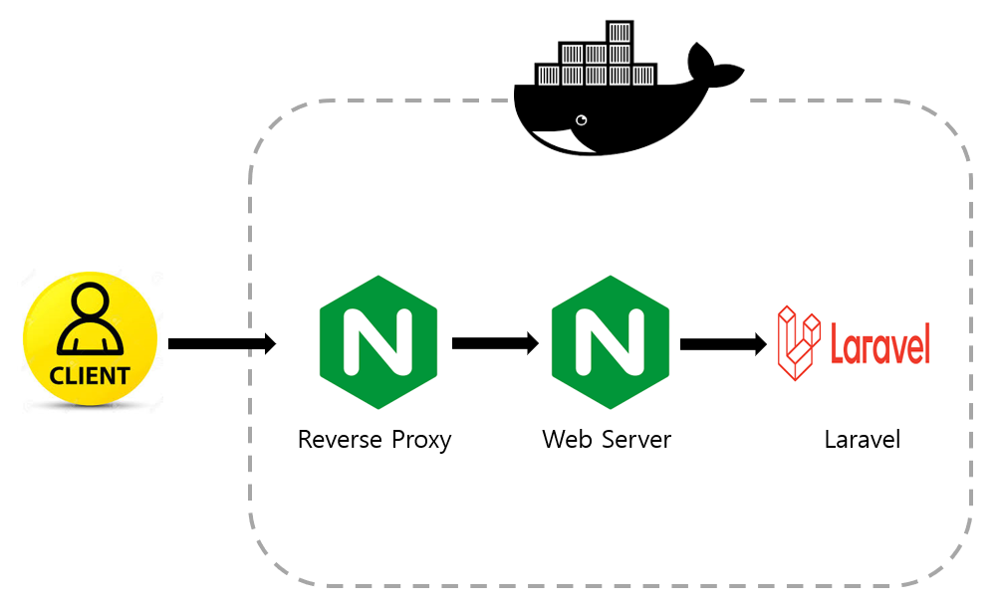

# Laravel container-quickstart
* Quickly start Laravel on localhost with docker

## Introduction
* Quickly install Laravel framework by using Nginx, Docker on localhost

## Design
* This has 3 container.
* one is nginx for reverse proxy. this first get packet from client and then send it to web server
* second is nginx for web server to execute index.php
* third is laravel 

# Getting Started
1. git clone https://github.com/programmer-sjk/container-quickstart.git
2. cd container-quickstart/laravel
3. docker-compose up -d
4. docker exec -it php-fpm bash
5. laravel new [project_name] 
   - project_name default value is laravel_project
   - if you want change project_name, you have to modify root in nginx/default.conf
6. cd [project_name]
7. create .env file
8. php artisan key:generate
9. open browser and connect localhost

