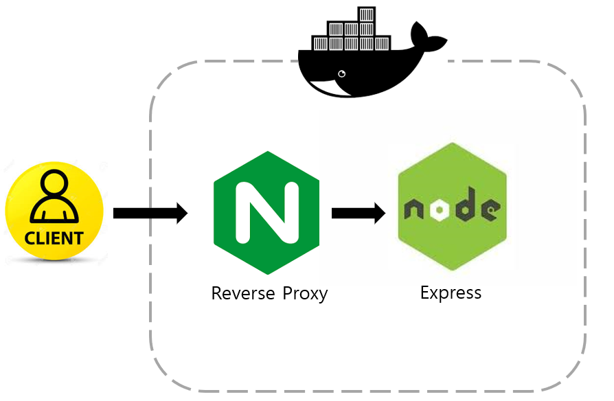

# Express container-quickstart
* Quickly start Express on localhost with docker

## Introduction
* Quickly install Express framework by using Nginx, Docker on localhost
* All files and directories in source directory, i use express-generator default output. 

## Design
* This has 2 container.
* first container is <b>nginx</b> for reverse proxy. this first get packet from client and then send it to web server
* second container is <b>express</b>

# Getting Started
1. git clone https://github.com/programmer-sjk/container-quickstart.git
2. cd container-quickstart/nginx-express
3. docker-compose up -d
4. open browser and connect localhost
